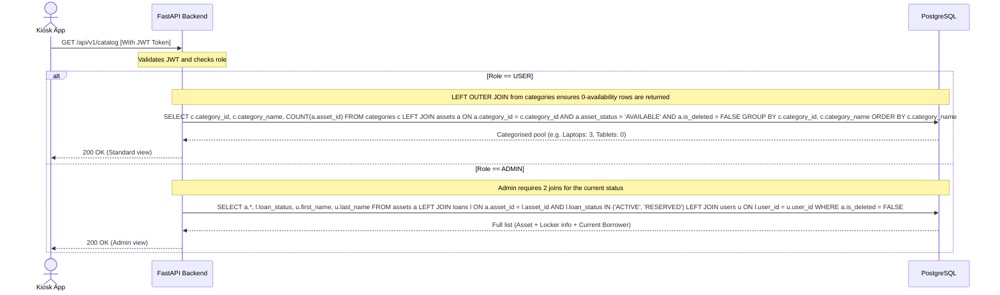
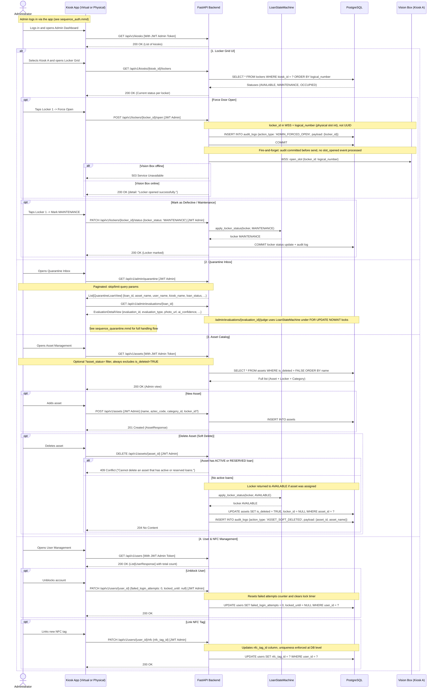

# Core endpoint reference

Key endpoints for the lending flow. Full specification available at the interactive `/docs` Swagger UI.

## 1. Authentication

- `POST /auth/nfc`: Validate NFC tag presence.
- `POST /auth/pin`: Verify PIN and issue JWT pair.
- `POST /auth/refresh`: Rotate credentials.
- `POST /auth/logout`: End session.

## 2. Users

- `GET /users/me`: Current user profile and role.

## 3. Transactions

- `POST /loans/checkout`: Initiate borrow. Requires aztec_code.
- `POST /loans/return/initiate`: Start return flow. Requires kiosk_id.
- `POST /loans/{id}/report-damage`: Grace-period report window.

## 4. Catalog

Clients retrieve available assets based on their authenticated role.

## 5. Vision

...

## 4. Vision

- `POST /vision/analyze`: AI inference trigger after door closure.
- `PATCH /update-model`: Atomic YOLO weight update.

## 6. Administration

- `GET /admin/quarantine`: List flagged items.
- `PATCH /admin/evaluations/{id}/judge`: Resolve quarantine cases.
- `GET /audit/verify`: Hash-chain integrity check.

Administrators manage system resources and resolve anomalies through the dedicated dashboard.

