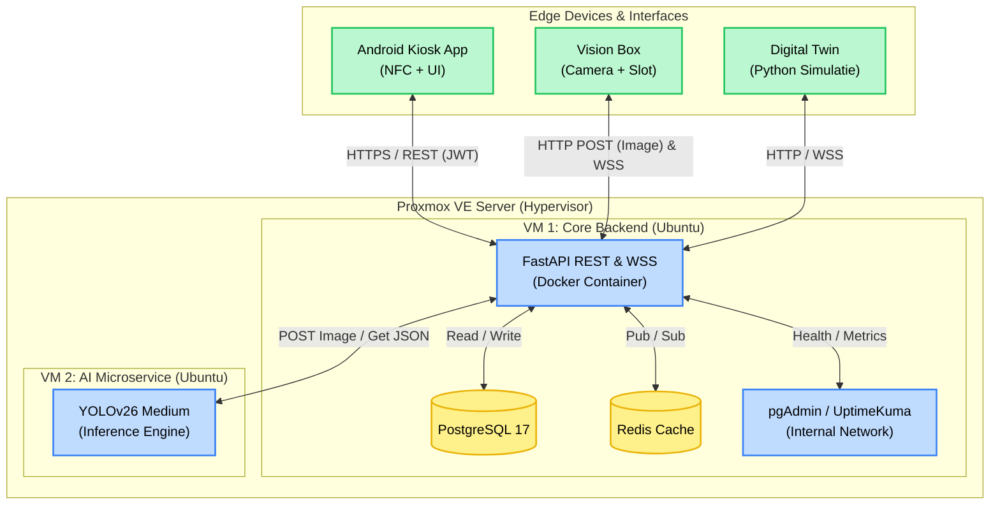
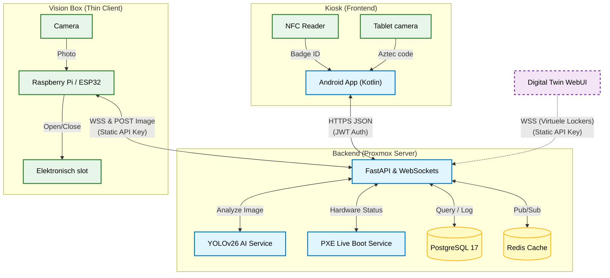
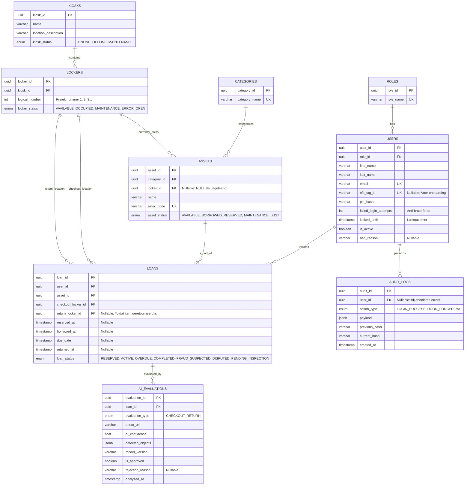

# EasyLend Systeemarchitectuur

Dit document bevat de macro-architectuur, infrastructuur-topologie en het databasemodel van het EasyLend platform.

## 1. Topologie

De architectuur is gebouwd rondom een gecentraliseerde **Proxmox Virtual Environment**. We hanteren het *Microservices Pattern* om de zware AI-inferentie te scheiden van de reactieve API. Hardware en simulaties fungeren als "Thin Clients".

### Fysieke topologie

### Logische topologie

## 2. Security & Core Principles

* **Zero-Trust Authenticatie:** Geen enkel endpoint is openbaar. Apparaten (Vision Box, Simulatie) gebruiken Static M2M API Keys (`X-Device-Token`). Kiosk-gebruikers gebruiken NFC-tags (UID) gecombineerd met een PIN (JWT).
* **Cryptografische Audit Trail:** Alle kritieke transacties (`LOGIN`, `DOOR_OPENED`, `PXE_CHECK`, `SELF_DECLARATION`) worden opgeslagen in `AUDIT_LOGS`. Elke rij bevat een `current_hash` gebaseerd op de payload én de `previous_hash` van de vorige rij, wat de database *tamper-proof* maakt.
* **No Hardcoding:** Hardcoded IP-adressen of secrets zijn verboden. Alles loopt via een `.env` bestand, strikt gevalideerd door FastAPI `pydantic-settings`.
* **Database Isolatie:** De database is niet blootgesteld aan het internet (`0.0.0.0` is verboden) en wordt door developers benaderd via een SSH Tunnel naar `127.0.0.1`.

## 3. Database Architectuur & Datamodel (ERD)

Het datamodel (PostgreSQL) is strikt genormaliseerd (3NF) en specifiek ontworpen om naadloos om te gaan met asynchrone hardware-statussen, AI-analyses en fraudepreventie.

### Kernconcepten van het Datamodel

1. **Dynamische Locker Toewijzing:** Assets zijn niet hardcoded gekoppeld aan één fysiek kluisje. De `ASSETS.locker_id` is merely de *huidige* locatie. Tijdens een uitleen-transactie (`LOAN`) registreert de database het `checkout_locker_id`. Bij het inleveren berekent de backend welk kluisje leeg is en wijst deze toe als `return_locker_id`. Dit voorkomt bottlenecks als kluisjes defect zijn.
2. **Geavanceerd State Management (Edge Cases):** Om real-world problemen (zoals verborgen defecten of gebruikers die elkaar beschuldigen) op te vangen, werken de enums nauw samen. Een verdachte inlevering triggert `loan_status = DISPUTED` of `PENDING_INSPECTION`. Het corresponderende kluisje wordt direct hardwarematig geblokkeerd via `locker_status = MAINTENANCE` (De Quarantaine-flow).
3. **JSONB voor Flexibiliteit (NoSQL in SQL):** Omdat hardware checks en AI-modellen onvoorspelbare of wisselende datastructuren genereren, gebruiken we het krachtige `JSONB` datatype van PostgreSQL.
   * `AI_EVALUATIONS.detected_objects` slaat de ruwe bounding-box data op.
   * `AUDIT_LOGS.payload` vangt alles op van PXE-boot hardware tests (`{"ram_ok": true}`) tot self-declarations (`{"has_damage": false}`).

### Entity Relationship Diagram

## 4. Operations & Monitoring (Ops)

Om de gezondheid van het systeem te waarborgen zonder zware overhead, maken we gebruik van lichtgewicht, geïsoleerde tooling:

* **Monitoring:** Uptime Kuma draait intern in de Docker-stack en monitort de FastAPI health-endpoints en de database-verbinding.
* **Backups (Disaster Recovery):** De database wordt dagelijks asynchroon geback-upt via een headless SQLBak container naar een off-site cloudlocatie, volledig buiten de scope van de applicatielogica.
