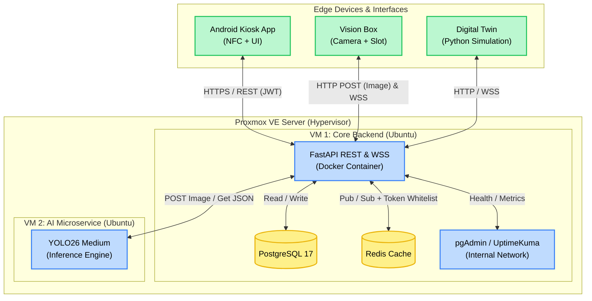
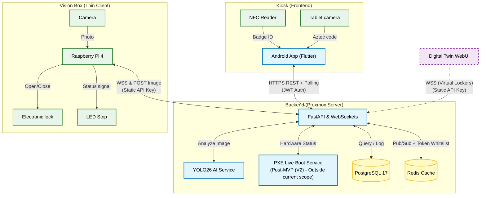

# EasyLend System Architecture

This document covers the macro-architecture, infrastructure topology, and database model of the EasyLend platform.

## 1. Topology

The architecture is built around a centralised **Proxmox Virtual Environment**. We apply the *Microservices Pattern* to isolate the heavy AI inference workload from the reactive API. Hardware and simulations act as "Thin Clients".

### Physical topology

```mermaid
flowchart TD
    %% STYLES
    classDef container fill:#bfdbfe,stroke:#3b82f6,stroke-width:2px,color:#000;
    classDef db fill:#fef08a,stroke:#eab308,stroke-width:2px,color:#000;
    classDef edge fill:#bbf7d0,stroke:#22c55e,stroke-width:2px,color:#000;

    subgraph Edge ["Edge Devices & Interfaces"]
        direction TB
        K["Android Kiosk App<br/>(NFC + UI)"]:::edge
        V["Vision Box<br/>(Camera + Slot)"]:::edge
        S["Digital Twin<br/>(Python Simulation)"]:::edge
    end

    subgraph Proxmox ["Proxmox VE Server (Hypervisor)"]
        direction TB

        subgraph VM1 ["VM 1: Core Backend (Ubuntu)"]
            API["FastAPI REST & WSS<br/>(Docker Container)"]:::container
            DB[("PostgreSQL 17")]:::db
            REDIS[("Redis Cache")]:::db
            MONITOR["pgAdmin / UptimeKuma<br/>(Internal Network)"]:::container
        end

        subgraph VM2 ["VM 2: AI Microservice (Ubuntu)"]
            YOLO["YOLO26 Medium<br/>(Inference Engine)"]:::container
        end
    end

    %% Connections
    K <-->|"HTTPS / REST (JWT)"| API
    V <-->|"HTTP POST (Image) & WSS"| API
    S <-->|"HTTP / WSS"| API

    API <-->|"Read / Write"| DB
    API <-->|"Pub / Sub + Token Whitelist"| REDIS
    API <-->|"POST Image / Get JSON"| YOLO
    API <-->|"Health / Metrics"| MONITOR

```

### Logical topology

```mermaid
flowchart TD
    %% STYLES (Corporate & Clean)
    classDef soft fill:#E1F5FE,stroke:#0277BD,stroke-width:2px,color:#000;
    classDef hard fill:#E8F5E9,stroke:#2E7D32,stroke-width:2px,color:#000;
    classDef data fill:#FFF9C4,stroke:#FBC02d,stroke-width:2px,color:#000;
    classDef sim  fill:#F3E5F5,stroke:#7B1FA2,stroke-width:2px,stroke-dasharray: 5 5,color:#000;

    %% DOMAIN 1: KIOSK (LEFT)
    subgraph Kiosk ["Kiosk (Frontend)"]
        direction TB
        NFC[NFC Reader]:::hard
        CamTab["Tablet camera"]:::hard
        App["Android App (Flutter)"]:::soft

        NFC -->|Badge ID| App
        CamTab -->|Aztec code| App
    end

    %% DOMAIN 2: BACKEND (CENTRE)
    subgraph Backend ["Backend (Proxmox Server)"]
        direction TB
        API["FastAPI & WebSockets"]:::soft
        AIService["YOLO26 AI Service"]:::soft
        PXE["PXE Live Boot Service<br/>(Post-MVP (V2) - Outside current scope)"]:::soft
        DB[(PostgreSQL 17)]:::data
        Redis[(Redis Cache)]:::data

        API <-->|"Query / Log"| DB
        API <-->|"Pub/Sub + Token Whitelist"| Redis
        API <-->|"Analyze Image"| AIService
        API <-->|"Hardware Status"| PXE
    end

    %% DOMAIN 3: VISION BOX (RIGHT)
    subgraph Box ["Vision Box (Thin Client)"]
        direction TB
        RPi["Raspberry Pi 4"]:::hard
        CamBox[Camera]:::hard
        Lock["Electronic lock"]:::hard
        LED["LED Strip"]:::hard

        CamBox -->|Photo| RPi
        RPi -->|"Open/Close"| Lock
        RPi -->|"Status signal"| LED
    end

    %% SIMULATION (BOTTOM)
    Sim["Digital Twin WebUI"]:::sim

    %% MAIN CONNECTIONS

    %% Kiosk communicates with API
    App <-->|"HTTPS REST + Polling<br/>(JWT Auth)"| API

    %% API communicates with Box
    RPi <-->|"WSS & POST Image<br/>(Static API Key)"| API

    %% Simulation tests the API
    Sim -.->|"WSS (Virtual Lockers)<br/>(Static API Key)"| API
```

## 2. Security & Core Principles

* **Zero-Trust Authentication:** In V1, virtually all endpoints require a valid Bearer JWT. There are **exactly four** auth endpoints that do not require a Bearer JWT header: `POST /api/v1/auth/nfc`, `POST /api/v1/auth/pin`, `POST /api/v1/auth/refresh`, and `POST /api/v1/auth/logout`. The first two are required for the login flow and are **rate-limited to 500 req/min per IP (Layer 2)**. `refresh` and `logout` validate the token from the JSON body. Hardware communication is additionally protected with `X-Device-Token` and static API keys from `.env` (`VISION_BOX_API_KEY`, `SIMULATION_API_KEY`) and is enforced on both `/api/v1/vision/analyze` and `/ws/visionbox/{kiosk_id}`. The Vision microservice can push updated model URLs via `POST /api/v1/vision/update-model` (also `X-Device-Token` protected).
* **Role Management:** Admins can enumerate available system roles via `GET /api/v1/roles` (Bearer JWT required).
* **Cryptographic Audit Trail:** All critical transactions (`LOGIN_SUCCESS`, `LOGIN_FAILED`, `USER_STATUS_CHANGED`, `USER_PIN_CHANGED`, `USER_NFC_ASSIGNED`, `USER_ANONYMIZED`, `KIOSK_STATUS_CHANGED`, `LOCKER_STATUS_CHANGED`, `ASSET_CREATED`, `ASSET_STATUS_CHANGED`, `ASSET_SOFT_DELETED`, `LOAN_CHECKOUT_INITIATED`, `LOAN_RETURN_INITIATED`, `LOAN_CHECKOUT_CONFIRMED`, `LOAN_CHECKOUT_FRAUD`, `LOAN_RETURN_CONFIRMED`, `VISION_EVALUATION_PROCESSED`, `VISION_EVALUATION_FAILED`, `ADMIN_FORCED_OPEN`, `EVALUATION_APPROVED`, `EVALUATION_REJECTED`, `LOAN_RESERVED_TIMEOUT`, `LOAN_OVERDUE`) are stored in `AUDIT_LOGS`. Each row contains a `current_hash` based on the payload and the `previous_hash` of the previous row (SHA-256, 64-char hex), making the database *tamper-proof*. Integrity is verifiable via `GET /api/v1/audit/verify` (hash-chain check).
* **Rate Limiting (Step 12):** Three-layer hybrid approach using Redis:
  * **Layer 2 – Public endpoints:** `POST /api/v1/auth/nfc` and `POST /api/v1/auth/pin` are rate-limited to **500 req/min per IP** to mitigate DDoS and horizontal brute-force while remaining tolerant of campus NAT.
  * **Layer 3 – Authenticated endpoints:** `POST /api/v1/loans/checkout` and `POST /api/v1/loans/return/initiate` are rate-limited to **60 req/min per user/kiosk ID** to prevent a compromised account or glitchy app from overloading the server without penalising other users on the same network.
  * **Layer 1 (existing):** The database-level brute-force lockout (`failed_login_attempts >= 5`) continues to protect individual accounts independently.
  * Rate limiting is fail-open: if Redis is unavailable the request is allowed so that a Redis outage does not block the entire API.
* **Centralized Transition Authority:** `LoanStateMachine` is the single source of truth for legal loan lifecycle transitions and coupled status outcomes on `LOANS`, `ASSETS`, and `LOCKERS`. Checkout/return vision callbacks, quarantine admin judgments, and background workers all resolve transitions through this shared domain module before mutating rows.
* **Lock-Scoped Vision Fallbacks:** `POST /api/v1/vision/analyze` performs AI inference first, then acquires `FOR UPDATE NOWAIT` locks in deterministic order (Loan → Asset → Locker). If AI evaluation fails, fallback mutation to `PENDING_INSPECTION` and `VISION_EVALUATION_FAILED` audit logging are executed and committed under those locks before the HTTP error is returned.
* **No Hardcoding:** Hardcoded IP addresses or secrets are prohibited. Everything is configured via a `.env` file, strictly validated by FastAPI `pydantic-settings`.
* **Database Isolation:** The database is not exposed to the internet (`0.0.0.0` is prohibited) and is accessed by developers via an SSH Tunnel to `127.0.0.1`.
* **PXE Live Boot Service:** This component is visible in the logical topology but falls **outside the scope of the current implementation (V1/MVP)**. PXE is planned for V2 (Post-MVP). References to `PXE_CHECK` audit actions and PXE-boot hardware tests are reserved for that release.

## 3. Database Architecture & Data Model (ERD)

The data model (PostgreSQL) is strictly normalised (3NF) and specifically designed to handle asynchronous hardware statuses, AI analyses, and fraud prevention seamlessly.

### Core Concepts of the Data Model

1. **Dynamic Locker Assignment:** Assets are not hardcoded to a single physical locker. `ASSETS.locker_id` is merely the *current* location. During a loan transaction, the database records the `checkout_locker_id`. On return, the backend calculates which locker is available and assigns it as `return_locker_id`. This prevents bottlenecks when lockers are faulty.
2. **Advanced State Management (Edge Cases):** To handle real-world problems (such as hidden defects or users accusing each other), the enums work closely together. A suspicious return triggers `loan_status = DISPUTED` or `PENDING_INSPECTION`. The corresponding locker is immediately locked in hardware via `locker_status = MAINTENANCE` (the Quarantine flow).
3. **JSONB for Flexibility (NoSQL in SQL):** Because hardware checks and AI models generate unpredictable or varying data structures, we use the powerful `JSONB` data type of PostgreSQL.
   * `AI_EVALUATIONS.detected_objects` stores the raw bounding-box data.
   * `AUDIT_LOGS.payload` captures everything from hardware events to self-declarations (`{"has_damage": false}`). PXE-boot hardware tests (`{"ram_ok": true}`) are reserved for V2 (Post-MVP).

4. **Soft Delete:** Assets are never physically deleted from the database. Setting `is_deleted = true` on an asset is gated by an active-loan guard: the operation returns `409 Conflict` if the asset has any `ACTIVE` or `RESERVED` loans. On successful soft-delete, `asset.locker_id` is set to `NULL` and the associated `Locker.locker_status` transitions to `AVAILABLE`. An `ASSET_SOFT_DELETED` audit event is written to the audit trail.

### Entity Relationship Diagram

```mermaid
erDiagram
    %% Lookup Tables
    ROLES ||--o{ USERS : has
    CATEGORIES ||--o{ ASSETS : categorizes

    %% Infrastructure
    KIOSKS ||--o{ LOCKERS : contains
    LOCKERS ||--o{ ASSETS : currently_holds

    %% Transactions
    USERS ||--o{ LOANS : initiates
    ASSETS ||--o{ LOANS : is_part_of
    LOCKERS ||--o{ LOANS : checkout_location
    LOCKERS ||--o{ LOANS : return_location

    %% Analyses, Security & AI
    LOANS ||--o{ AI_EVALUATIONS : evaluated_by
    AI_EVALUATIONS ||--o{ DAMAGE_REPORTS : detects
    USERS ||--o{ AUDIT_LOGS : performs

    ROLES {
        uuid role_id PK
        varchar role_name UK
    }

    CATEGORIES {
        uuid category_id PK
        varchar category_name UK
    }

    USERS {
        uuid user_id PK
        uuid role_id FK
        varchar first_name
        varchar last_name
        varchar email UK
        varchar nfc_tag_id UK "Nullable: For onboarding"
        varchar pin_hash
        int failed_login_attempts "Anti-brute-force"
        timestamp locked_until "Lockout timer"
        enum status "ACTIVE, INACTIVE, BANNED, ANONYMIZED"
        varchar ban_reason "Nullable"
        boolean accepted_privacy_policy
    }

    KIOSKS {
        uuid kiosk_id PK
        varchar name
        varchar location_description
        enum kiosk_status "ONLINE, OFFLINE, MAINTENANCE"
    }

    LOCKERS {
        uuid locker_id PK
        uuid kiosk_id FK
        int logical_number "Physical number 1, 2, 3... (UK per kiosk: uq_kiosk_logical_number)"
        enum locker_status "AVAILABLE, OCCUPIED, MAINTENANCE, ERROR_OPEN"
    }

    ASSETS {
        uuid asset_id PK
        uuid category_id FK
        uuid locker_id FK "Nullable: NULL when on loan or in inspection"
        varchar name
        varchar aztec_code UK
        enum asset_status "AVAILABLE, BORROWED, RESERVED, PENDING_INSPECTION, MAINTENANCE, LOST"
        boolean is_deleted
    }

    LOANS {
        uuid loan_id PK
        uuid user_id FK
        uuid asset_id FK
        uuid checkout_locker_id FK
        uuid return_locker_id FK "Nullable: Until item is returned"
        timestamp reserved_at "Nullable"
        timestamp borrowed_at "Nullable"
        timestamp due_date "Nullable"
        timestamp returned_at "Nullable"
        enum loan_status "RESERVED, ACTIVE, RETURNING, OVERDUE, COMPLETED, FRAUD_SUSPECTED, DISPUTED, PENDING_INSPECTION"
    }
    %% (*) RETURNING is a pre-vision mutex set by POST /loans/return/initiate.
    %%     It prevents duplicate return initiations and is enforced by POST /vision/analyze
    %%     (409 if loan_status != RETURNING for a RETURN evaluation).

    AI_EVALUATIONS {
        uuid evaluation_id PK
        uuid loan_id FK
        enum evaluation_type "CHECKOUT, RETURN"
        varchar photo_url
        float ai_confidence "NOT NULL: 0.0 when no detections"
        jsonb detected_objects "E.g. detections list with bounding boxes"
        boolean has_damage_detected "Quickly filter problem evaluations"
        varchar model_version "NOT NULL: e.g. 'yolo26-dual-model'"
        boolean is_approved "Nullable: set by admin judge endpoint"
        varchar rejection_reason "Nullable: admin note when is_approved=false"
        timestamp analyzed_at
    }

    DAMAGE_REPORTS {
        uuid damage_id PK
        uuid evaluation_id FK
        varchar damage_type "E.g. scratch, crack, missing key"
        varchar severity "Free-form string"
        jsonb segmentation_data "YOLO polygon/bounding box coordinates"
        boolean requires_repair
    }

    AUDIT_LOGS {
        uuid audit_id PK
        uuid user_id FK "Nullable: For anonymous errors"
        varchar action_type "LOGIN_SUCCESS, LOGIN_FAILED, USER_ANONYMIZED, USER_STATUS_CHANGED, EVALUATION_APPROVED, EVALUATION_REJECTED, VISION_EVALUATION_PROCESSED, VISION_EVALUATION_FAILED, ADMIN_FORCED_OPEN, ASSET_SOFT_DELETED, LOAN_RESERVED_TIMEOUT, LOAN_OVERDUE, LOAN_CHECKOUT_INITIATED, LOAN_CHECKOUT_CONFIRMED, LOAN_CHECKOUT_FRAUD, LOAN_RETURN_INITIATED, LOAN_RETURN_CONFIRMED, ASSET_CREATED, ASSET_STATUS_CHANGED, USER_PIN_CHANGED, USER_NFC_ASSIGNED, LOCKER_STATUS_CHANGED, KIOSK_STATUS_CHANGED"
        jsonb payload
        varchar(64) previous_hash "NOT NULL: SHA-256 hex of predecessor"
        varchar(64) current_hash "NOT NULL: SHA-256 hex of this record"
        timestamp created_at
    }

```

## 4. Operations & Monitoring (Ops)

To ensure system health without heavy overhead, we use lightweight, isolated tooling:

* **Monitoring:** Uptime Kuma runs internally in the Docker stack and monitors the FastAPI health endpoints and database connection.
* **Backups (Disaster Recovery):** The database is backed up daily to an off-site cloud location, completely outside the scope of the application logic.

### Background Workers

* **Reserved Loan Timeout Worker:** Every 60 seconds, the worker scans for `RESERVED` loans older than 3 minutes (configurable). Each candidate is processed in its own transaction with per-row `NOWAIT` locks, transitioned via `LoanStateMachine` to `PENDING_INSPECTION`, audited as `LOAN_RESERVED_TIMEOUT`, and isolated from poison-pill records by excluding IDs that fail repeatedly in the same run.
* **Overdue Loan Worker:** Every 1 hour (configurable), the worker scans for `ACTIVE` loans whose `due_date` has passed. Each loan is row-locked with `NOWAIT`, transitioned through `LoanStateMachine` to `OVERDUE`, and audited as `LOAN_OVERDUE`, with in-run poison-pill exclusion so one permanently failing record does not stall the batch.
