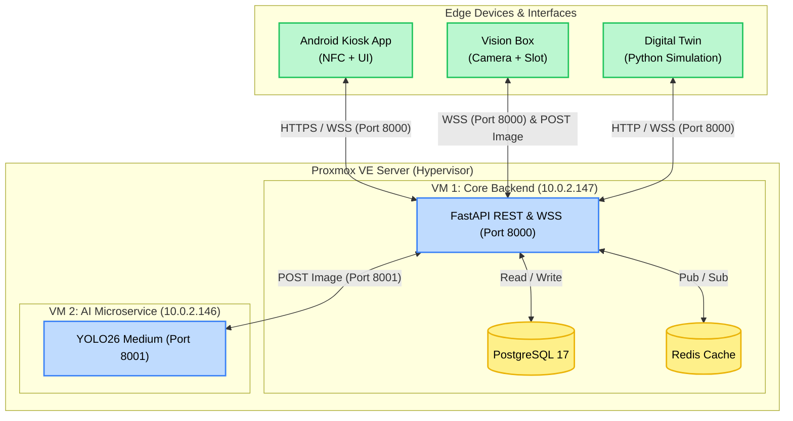
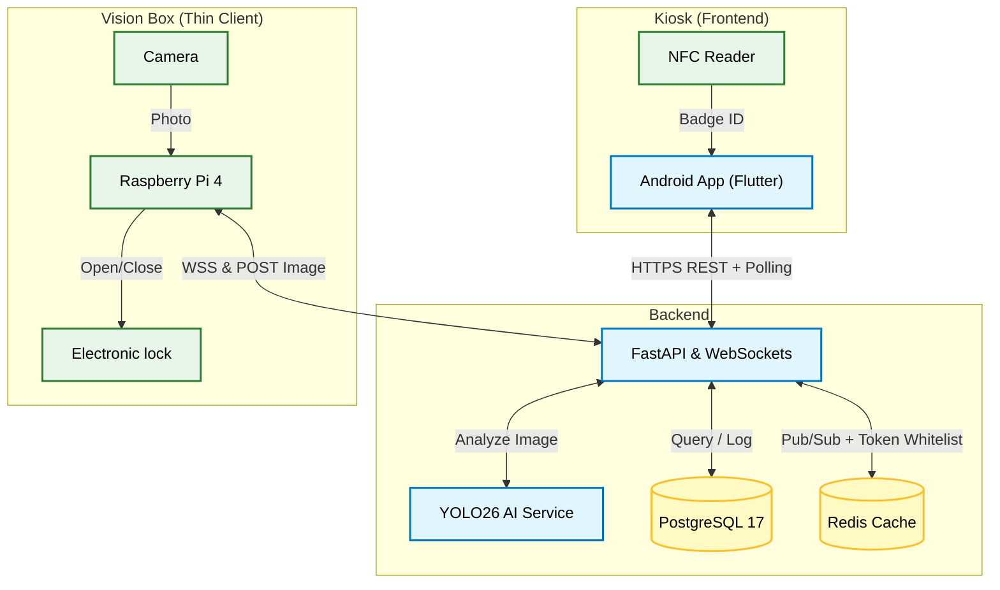

# System Topology

EasyLend uses a microservices-inspired architecture designed to isolate heavy AI inference workloads from reactive API traffic. Our infrastructure is centralized on a Proxmox Virtual Environment, with physical hardware and simulations acting as "Thin Clients."

## Physical Topology
We split our workloads across two Virtual Machines (Ubuntu) to ensure that YOLO inference does not starve the main API of CPU or Memory resources.

## Logical Topology
Our logical structure is divided into three primary domains: the **Kiosk (Frontend)**, the **Backend (API & AI)**, and the **Vision Box (Hardware Orchestrator)**.

