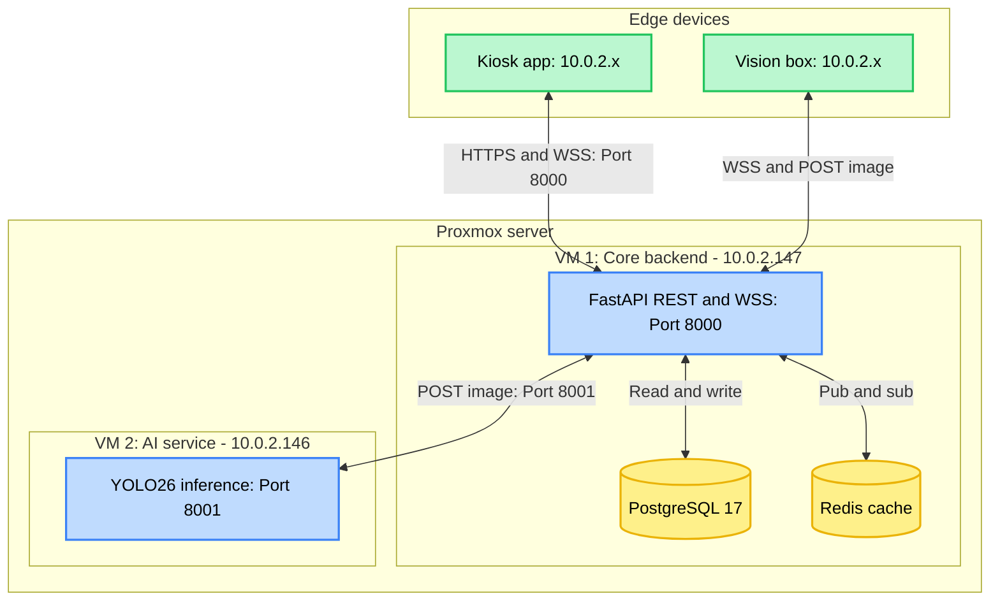
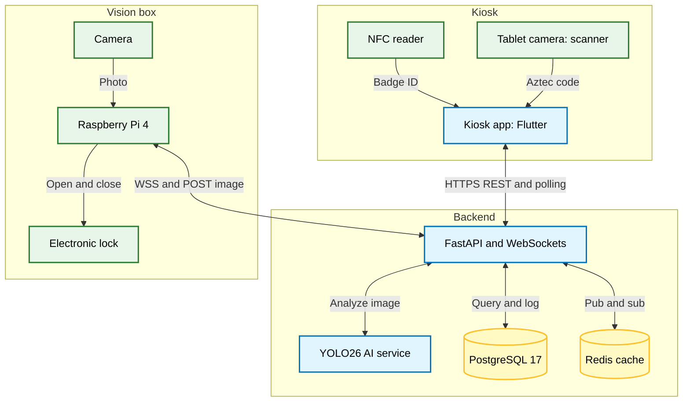

# System topology

EasyLend uses a microservices-inspired architecture to isolate heavy AI inference from reactive API traffic. Infrastructure is centralized on Proxmox, with edge hardware acting as thin clients.

## Physical topology

Workloads are split across two virtual machines to prevent resource starvation during inference.

## Logical topology

The system is divided into three functional domains.

