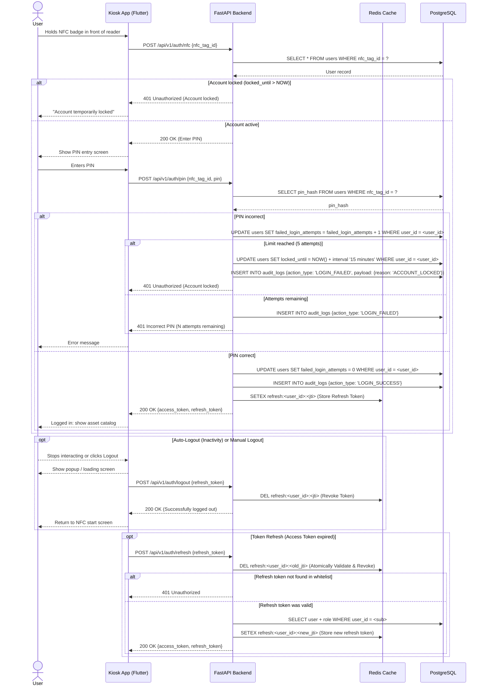

# Zero-trust architecture

EasyLend assumes no network segment, device, or account is inherently safe. Trust is verified at every layer of the interaction chain.

## 1. Trustless service communication

Interaction between core services and edge devices does not rely on local network safety.

- **Hardware authentication:** Vision boxes and simulators must provide an `X-Device-Token` for all requests. Comparisons are timing-safe to mitigate side-channel attacks.
- **Microservice authentication:** The vision AI service requires a `VISION_API_KEY`, ensuring only the authorized backend can trigger inference workloads.

## 2. Stateless verification

We implement strict verification for all kiosk interactions, ensuring every request is independently validated.

## 3. Concurrency trust

Database logic follows a trust-no-one approach to mutation.

- **Optimistic inference:** We do not hold database locks during slow AI processing. We perform a pre-flight read, run the AI, and re-verify assumptions during a short, locked finalization phase.
- **Conflict awareness:** Transactions assume concurrent access to the same resources, utilizing fail-fast locking to maintain integrity.

## 4. Hardware verification

The API does not assume a command succeeded just because it was delivered.

- We rely on polling and state transitions to confirm physical outcomes.
- A loan only advances to `ACTIVE` once vision AI confirms the locker is physically empty.
