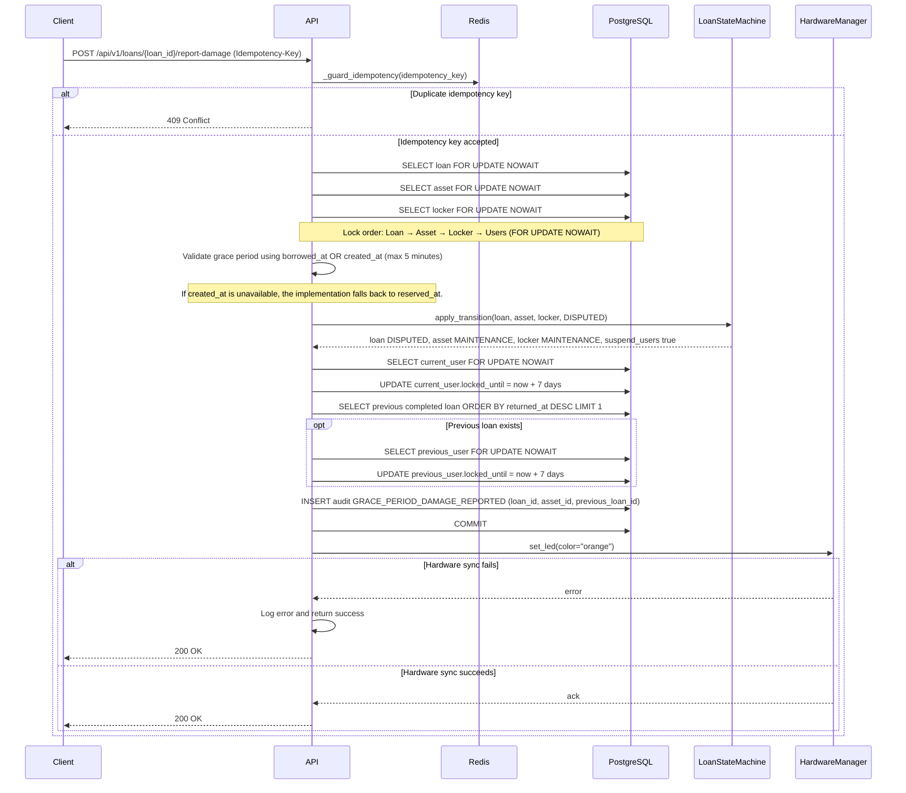

# Discipline policy

EasyLend implements automated disciplinary actions to protect equipment and ensure accountability during damage disputes.

## 1. Automatic suspension

A user's account is automatically locked for 7 days under these conditions:

- **Grace-period report:** User reports an item is damaged immediately after pickup.
- **AI-detected damage:** Vision AI flags damage during return and an admin approves the finding.

## 2. Suspension scope

When a suspension is triggered:

1. The **current borrower** is locked.
2. For damage reports, the **previous borrower** is also locked pending investigation to determine liability.
3. `User.locked_until` is updated atomically using a `FOR UPDATE NOWAIT` lock.

## 3. Resolution

Only a system administrator can lift a suspension early by resetting the `locked_until` timestamp and the failed login attempts counter.
