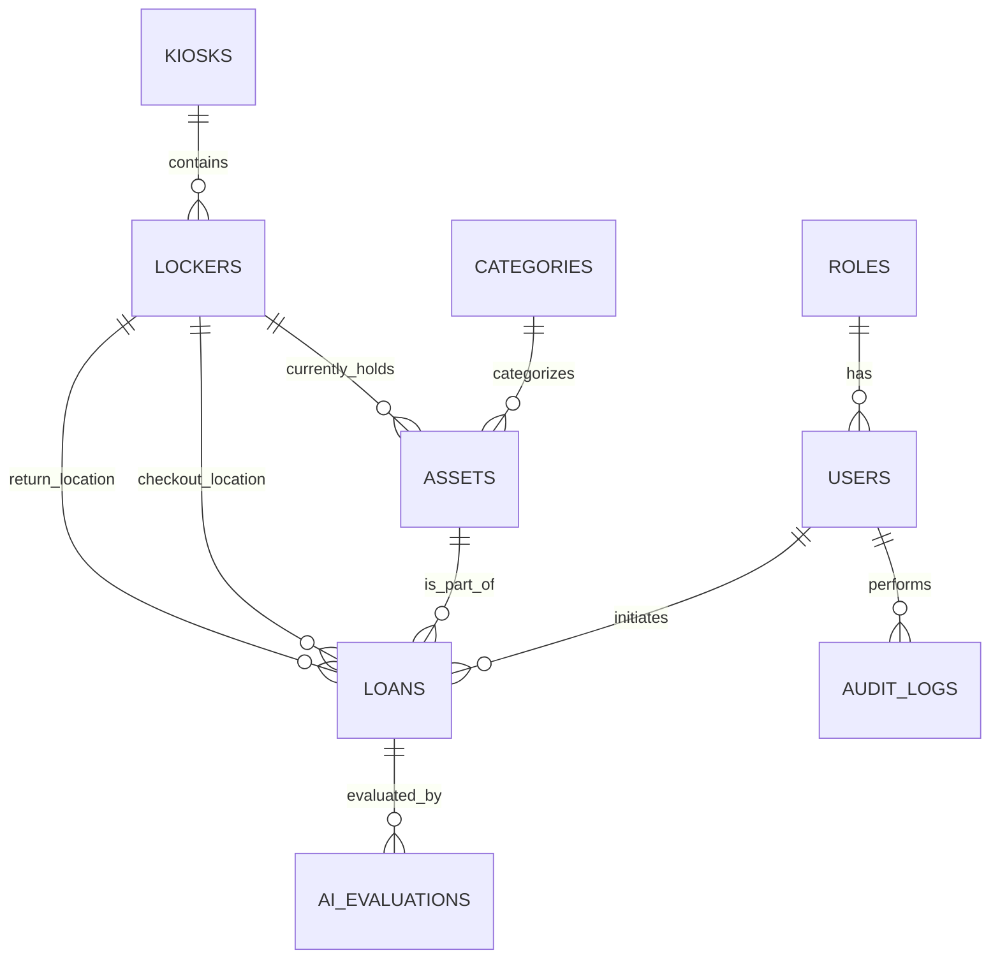

# Database Schema

EasyLend uses a strictly normalized (3NF) PostgreSQL 17 database designed to handle asynchronous hardware statuses and flexible AI analysis results.

## Entity Relationship Diagram (ERD)
The schema balances rigid transactional integrity for loans with flexible JSONB storage for AI detections.

## Core Concepts

### 1. Dynamic Locker Assignment
Assets are not hardcoded to physical slots. `ASSETS.locker_id` represents the *current* location. During checkout, we record the source locker; during return, the system dynamically allocates the first available slot at the user's kiosk. This handles faulty lockers gracefully.

### 2. JSONB Flexibility
We use PostgreSQL's `JSONB` type for:
- **`AI_EVALUATIONS.detected_objects`**: Stores raw YOLO bounding box and class data.
- **`AUDIT_LOGS.payload`**: Captures rich event context without schema bloat.

### 3. Soft Delete
Assets are never physically removed. The `is_deleted` flag is gated by an active-loan guard, ensuring we never "delete" an item that is currently in a user's possession.

### 4. Integrity Chain
The `AUDIT_LOGS` table implements a cryptographic hash-chain, where each row's `current_hash` depends on the `previous_hash` of the preceding record, making the audit trail tamper-proof.
