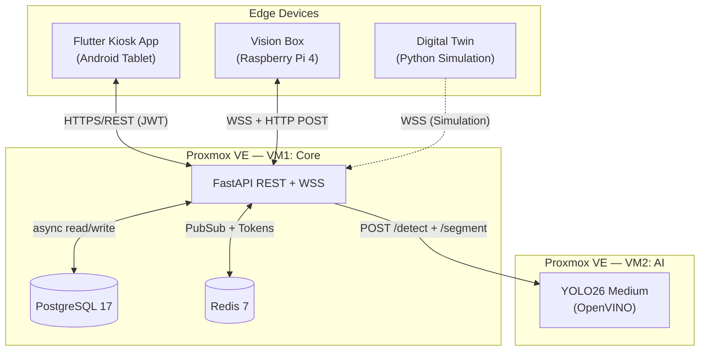

# EasyLend — Comprehensive Architecture Audit

> **Scope:** Full monorepo traversal — every endpoint, model, worker, test, config, migration, CI workflow, and frontend screen.
> **Method:** Implementation-aware analysis. Zero assumptions — all findings derived from source code.

---

## 1. System Overview

**EasyLend** is an IoT-enabled equipment lending platform for educational campuses. Users authenticate via NFC + PIN at physical kiosk stations, borrow assets from electronically-locked compartments, and return them for AI-powered damage inspection.

### Architecture Pattern

**Microservices + Thin-Client Edge + Event-Driven Audit Trail**



| Component | Stack | Lines of Code (est.) |
|-----------|-------|---------------------|
| Backend API | Python 3.13, FastAPI, SQLAlchemy 2.0 (async), Pydantic V2 | ~6,000 |
| Vision AI Service | Python, FastAPI, Ultralytics YOLO, OpenVINO, Pillow | ~600 |
| Kiosk Frontend | Flutter/Dart, Riverpod, Dio/Retrofit, GoRouter | ~3,500 |
| Simulation | Python, websockets | ~55 |
| Infrastructure | Docker Compose, GitHub Actions, Alembic, Grype | ~500 |

---

## 2. Backend API — Deep Dive

### 2.1 Application Lifecycle

[main.py](file:///d:/source/repos/EA_ICT/easylend-practice-enterprise/easylend/backend/api/app/main.py) — The FastAPI app uses an async `lifespan` context manager that:

1. Verifies Redis connectivity on startup
2. Spawns two background `asyncio.Task` workers (loan-timeout, overdue)
3. Gracefully cancels both workers on shutdown

**Middleware stack** (applied in order):
- `SecurityHeadersMiddleware` — injects CSP, X-Content-Type-Options, X-Frame-Options, Referrer-Policy, Permissions-Policy
- `CORSMiddleware` — origin-validated, credentials-enabled
- `BasicAuth` gate on `/docs` and `/redoc` (production only)

### 2.2 API Surface — Complete Endpoint Map

Registered via [router.py](file:///d:/source/repos/EA_ICT/easylend-practice-enterprise/easylend/backend/api/app/api/v1/router.py):

| Router | Prefix | Key Endpoints | Auth |
|--------|--------|--------------|------|
| `auth` | `/auth` | `POST /nfc`, `POST /pin`, `POST /refresh`, `POST /logout` | Public (rate-limited) |
| `roles` | `/roles` | `GET /` | Bearer JWT |
| `users` | `/users` | `GET /`, `GET /me`, `GET /{id}`, `POST /`, `PATCH /{id}`, `PATCH /{id}/nfc`, `POST /{id}/anonymize`, `GET /{id}/export` | Admin / Self |
| `categories` | `/categories` | `GET /`, `POST /`, `PATCH /{id}` | JWT (write=Admin) |
| `kiosks` | `/kiosks` | `GET /`, `POST /`, `GET /{id}/lockers`, `PATCH /{id}/status` | Admin |
| `lockers` | `/lockers` | `GET /`, `GET /{id}`, `POST /`, `POST /{id}/open`, `PATCH /{id}/status` | Admin |
| `catalog` | `/catalog` | `GET /` (role-aware: student→aggregated, admin→full detail) | JWT |
| `assets` | `/assets` | `GET /`, `GET /{id}`, `POST /`, `PATCH /{id}`, `DELETE /{id}` | JWT (write=Admin) |
| `loans` | `/loans` | `GET /`, `GET /{id}/status`, `POST /checkout`, `POST /return/initiate`, `POST /{id}/report-damage` | JWT |
| `vision` | `/vision` | `POST /analyze`, `PATCH /update-model` | X-Device-Token |
| `admin` | `/admin` | `GET /quarantine`, `GET /evaluations/{id}`, `PATCH /evaluations/{id}/judge` | Admin |
| `audit` | `/audit` | `GET /verify` | Admin |
| `images` | `/images` | `GET /{filename}` | JWT (Admin or Loan Owner) |
| `ws` | `/ws` | `WS /visionbox/{kiosk_id}` | X-Device-Token |

**Total: 30+ REST endpoints + 1 WebSocket channel.**

### 2.3 Database Architecture

**Engine:** PostgreSQL 17 via `asyncpg` + SQLAlchemy 2.0 async sessions.

**9 Alembic migrations** track schema evolution from initial schema through enum refactors, RETURNING status, soft-delete, and privacy policy fields.

#### Entity Relationship Summary

| Entity | PK | Key Columns | Relationships |
|--------|-----|-------------|---------------|
| `ROLES` | `role_id` (UUID) | `role_name` (UK) | → Users |
| `CATEGORIES` | `category_id` | `category_name` (UK) | → Assets |
| `USERS` | `user_id` | `email` (UK), `nfc_tag_id` (UK, HMAC-SHA256), `pin_hash` (bcrypt), `status` enum, `failed_login_attempts`, `locked_until` | → Loans, AuditLogs |
| `KIOSKS` | `kiosk_id` | `name`, `kiosk_status` enum | → Lockers |
| `LOCKERS` | `locker_id` | `kiosk_id` (FK), `logical_number` (UK per kiosk), `locker_status` enum | → Assets, Loans |
| `ASSETS` | `asset_id` | `aztec_code` (UK), `locker_id` (FK, nullable), `asset_status` enum, `is_deleted` | → Loans |
| `LOANS` | `loan_id` | `user_id`, `asset_id`, `checkout_locker_id`, `return_locker_id`, timestamps, `loan_status` enum | → Evaluations |
| `AI_EVALUATIONS` | `evaluation_id` | `loan_id`, `evaluation_type`, `ai_confidence`, `detected_objects` (JSONB), `has_damage_detected`, `is_approved` (nullable) | → DamageReports |
| `DAMAGE_REPORTS` | `damage_id` | `evaluation_id`, `damage_type`, `severity`, `segmentation_data` (JSONB) | — |
| `AUDIT_LOGS` | `audit_id` | `action_type`, `payload` (JSONB), `previous_hash`, `current_hash` (SHA-256 chain) | — |

### 2.4 State Machine

[state_machine.py](file:///d:/source/repos/EA_ICT/easylend-practice-enterprise/easylend/backend/api/app/core/state_machine.py) — `LoanStateMachine` is the **single source of truth** for all loan lifecycle transitions. Every status change across `Loan`, `Asset`, and `Locker` entities goes through this module.

```
RESERVED → ACTIVE (checkout confirmed)
RESERVED → PENDING_INSPECTION (timeout / fraud)
RESERVED → FRAUD_SUSPECTED (empty locker detected)
ACTIVE → RETURNING (return initiated)
ACTIVE → OVERDUE (due date passed)
ACTIVE → DISPUTED (grace-period damage report)
RETURNING → COMPLETED (return confirmed, no damage)
RETURNING → PENDING_INSPECTION (damage detected / timeout)
PENDING_INSPECTION → ACTIVE (admin rejects checkout eval)
PENDING_INSPECTION → COMPLETED (admin rejects return eval)
PENDING_INSPECTION → DISPUTED (admin approves damage)
OVERDUE → RETURNING (late return initiated)
```

`LoanTransitionOutcome` carries correlated status for `loan_status`, `asset_status`, `locker_status`, and a `suspend_users` flag for dispute flows.

### 2.5 Concurrency & Locking Model

| Flow | Lock Strategy | Lock Order |
|------|--------------|------------|
| Checkout | `FOR UPDATE NOWAIT` on Asset, Locker | Asset → Locker |
| Return Initiate | `FOR UPDATE SKIP LOCKED` on Locker (allocation) | Loan → Asset → Locker |
| Vision Analyze | Pre-flight read → AI inference (no lock) → `FOR UPDATE NOWAIT` on Loan, Asset, Locker | Loan → Asset → Locker |
| Report Damage | `FOR UPDATE NOWAIT` | Loan → Asset → Locker → Users |
| Admin Judge | `FOR UPDATE NOWAIT` | Evaluation → Loan → Asset → Locker |
| Anonymize User | `FOR UPDATE NOWAIT` + exponential backoff (3 retries) | User |
| Auth PIN Login | `FOR UPDATE NOWAIT` on User (serialize brute-force) | User |

**All conflict responses are immediate** (`409 Conflict`) — no lock convoys or deadlock risk.

### 2.6 Security Posture

| Layer | Implementation |
|-------|---------------|
| **Authentication** | JWT (access + refresh) with Redis whitelist; NFC tags hashed via HMAC-SHA256; PINs hashed via bcrypt |
| **Brute-force** | 5 attempts → 15-min lockout (DB-level); 500 req/min per IP (Redis rate limiter) |
| **Rate Limiting** | 3-layer: DB lockout, IP-based (public), user-based (authenticated). Fail-open on Redis outage |
| **Idempotency** | Redis `SET NX EX` (24h TTL) on checkout, return, report-damage, force-open |
| **Device Auth** | Timing-safe `secrets.compare_digest` for Vision Box and Simulation API keys |
| **GDPR** | `POST /users/{id}/anonymize` (Right to Erasure), `GET /users/{id}/export` (Right to Portability) |
| **Audit Trail** | SHA-256 hash-chained append-only log, verifiable via `GET /audit/verify` |
| **Security Headers** | CSP, X-Frame-Options DENY, X-Content-Type-Options, Referrer-Policy, Permissions-Policy |
| **SSRF Protection** | Vision service validates all model download URLs — HTTPS-only, DNS-resolved to global IPs only |
| **Config Hardening** | Startup fail-fast on dummy/placeholder secrets in production mode |

### 2.7 Background Workers

| Worker | File | Interval | Purpose |
|--------|------|----------|---------|
| Loan Timeout | [loan_timeout_worker.py](file:///d:/source/repos/EA_ICT/easylend-practice-enterprise/easylend/backend/api/app/workers/loan_timeout_worker.py) | 60s | Marks `RESERVED`/`RETURNING` loans as `PENDING_INSPECTION` after configurable timeout |
| Overdue | [overdue_worker.py](file:///d:/source/repos/EA_ICT/easylend-practice-enterprise/easylend/backend/api/app/workers/overdue_worker.py) | 1h | Marks `ACTIVE` loans past `due_date` as `OVERDUE` |

Both workers use:
- **Distributed Redis locks** (prevents duplicate execution across replicas)
- **Per-row NOWAIT locks** (no interference with concurrent API traffic)
- **Batch processing with poison-pill exclusion** (one failing record doesn't stall the batch)
- **Individual transactions per loan** (failure isolation)

### 2.8 WebSocket Architecture

[websockets.py](file:///d:/source/repos/EA_ICT/easylend-practice-enterprise/easylend/backend/api/app/core/websockets.py) — `ConnectionManager` provides:

- Redis PubSub-backed command forwarding (decouples API logic from hardware)
- Per-kiosk connection tracking with automatic old-connection eviction
- 100-connection global limit
- Heartbeat presence via Redis TTL keys (10s refresh)
- Commands: `open_slot` (with `loan_id`, `evaluation_type`, `locker_id`), `set_led` (color signaling)

---

## 3. Vision AI Microservice

[main.py](file:///d:/source/repos/EA_ICT/easylend-practice-enterprise/easylend/backend/vision/main.py) — Standalone FastAPI service running on VM2.

| Feature | Implementation |
|---------|---------------|
| **Detection** | `POST /detect` — YOLO26 Medium object detection, returns class/confidence list + `locker_empty` boolean |
| **Segmentation** | `POST /segment` — YOLO26 segmentation model for damage detection |
| **Model Updates** | `POST /update-model` — HTTPS download with SSRF protection, atomic replace, backup/restore on failure, scheduled restart |
| **Inference Format** | OpenVINO-optimized (auto-exported on first load for CPU acceleration) |
| **Memory Safety** | Explicit `gc.collect()` + tensor cleanup in `finally` blocks |
| **Health** | `GET /health` — reports `healthy`/`degraded` based on model availability |

---

## 4. Flutter Kiosk Frontend

[pubspec.yaml](file:///d:/source/repos/EA_ICT/easylend-practice-enterprise/easylend/kiosk-app/easylend_kiosk/pubspec.yaml) — Flutter 3.11+ targeting Android tablets in landscape kiosk mode.

### Implementation Status

| Component | Status | Details |
|-----------|--------|---------|
| Project Structure | ✅ Complete | screens/, providers/, models/, services/, widgets/ |
| Theme + Dark Mode | ✅ Complete | `AppColors`, `AppTheme` |
| Login Screen | ✅ Partial | UI + NFC animation; no real NFC hardware (`nfc_manager` not installed) |
| PIN Entry Screen | ✅ Complete | UI + API integration scaffolding |
| Asset Catalog | ✅ Partial | UI with Riverpod state; API contract validation pending |
| Aztec Scanner | ✅ Complete | `camera` + `google_mlkit_barcode_scanning` working |
| Return Status | ✅ Partial | Polling UI structure; backend validation pending |
| Lending Complete | ✅ Partial | Screen + countdown timer; business integration partial |
| Inactivity Modal | ✅ Complete | Countdown timer + stay/logout actions |
| GoRouter | ✅ Complete | Auth guards, debug route, error page |
| Riverpod Providers | ✅ Partial | Auth, catalog, loan polling implemented; legacy stubs remain |
| Secure Storage | ✅ Complete | JWT persistence via `flutter_secure_storage` |
| Kiosk Mode | ✅ Complete | Lock task allowlisting via `kiosk_mode` package |

**Loan Polling** — Implements exponential backoff: 2s (0-10s) → 5s (10-30s) → 10s (30-45s), with 45s max timeout. Terminal states: `COMPLETED`, `FRAUD_SUSPECTED`, `DISPUTED`, `PENDING_INSPECTION`.

### Outstanding Work (from [implementation-plan.md](file:///d:/source/repos/EA_ICT/easylend-practice-enterprise/easylend/kiosk-app/easylend_kiosk/implementation-plan.md))

- NFC hardware integration (`nfc_manager` not yet in pubspec)
- Dio 401 interceptor for automatic token refresh
- System maintenance overlay on health check failure
- Real API integration for checkout/return flows
- Admin-specific UI views (force-open, full asset list)
- ~20 placeholder files remain empty (legacy scaffolding)

---

## 5. Infrastructure & CI/CD

### Docker Compose

| File | Environment | Services |
|------|------------|----------|
| [docker-compose.prod.yml](file:///d:/source/repos/EA_ICT/easylend-practice-enterprise/easylend/backend/docker-compose.prod.yml) | Production | `migrator`, `api` (4GB), `timeout_worker`, `overdue_worker`, `postgres:17`, `redis:7-alpine`, `watchtower` |
| [docker-compose.local.yml](file:///d:/source/repos/EA_ICT/easylend-practice-enterprise/easylend/backend/docker-compose.local.yml) | Development | Same + `pgadmin4`, open ports, build-from-source |

Key production patterns:
- **Migrator-first**: `migrator` runs `alembic upgrade head`, then `api` starts via `service_completed_successfully` dependency
- **Watchtower**: Auto-pulls from GHCR every 300s with `ntfy` webhook notifications
- **PostgreSQL**: Bound to `127.0.0.1:5432` (not internet-exposed), health-checked
- **Redis**: Password-protected, AOF persistence

### GitHub Actions CI/CD

[backend-docker-build.yml](file:///d:/source/repos/EA_ICT/easylend-practice-enterprise/easylend/.github/workflows/backend-docker-build.yml) — Three-stage pipeline:

1. **Lint & Test** — `ruff check`, `ruff format --check`, `pytest` (Python 3.13, uv)
2. **Security Scan** — Grype vulnerability scan (SARIF upload to GitHub Security on main)
3. **Docker Build & Push** — Multi-tag (`latest` + SHA) to GHCR with BuildKit cache

---

## 6. Test Suite

**21 test files** covering all major subsystems:

| Test File | Coverage Area |
|-----------|--------------|
| `test_auth_api.py` | NFC/PIN login, brute-force lockout, refresh rotation, logout |
| `test_loans_api.py` (44KB) | Checkout, return, status polling, ownership checks |
| `test_vision_api.py` (48KB) | AI analyze flow, two-phase commit, fallback mutations |
| `test_equipment_api.py` (32KB) | CRUD for categories, kiosks, lockers, assets, catalog |
| `test_users_api.py` (30KB) | CRUD, anonymization, NFC update, GDPR export |
| `test_admin_api.py` | Quarantine list, evaluation detail, admin judgment |
| `test_checkout_flow.py` | E2E checkout with hardware mock coordination |
| `test_loan_timeout_worker.py` | Timeout worker batch processing, poison-pill isolation |
| `test_overdue_worker.py` | Overdue detection, NOWAIT lock skip, state transitions |
| `test_state_machine.py` | All valid/invalid transition paths |
| `test_rate_limit.py` | IP/user rate limiting, fail-open behavior |
| `test_audit_api.py` | Hash-chain verification endpoint |
| `test_ws_api.py` + `test_ws_send_command.py` | WebSocket auth, command dispatch |
| `test_security.py` | JWT creation/verification, PIN hashing, NFC hashing |
| `test_deps.py` | Dependency injection, token verification |

---

## 7. Documentation Quality

| Document | Content |
|----------|---------|
| [architecture.md](file:///d:/source/repos/EA_ICT/easylend-practice-enterprise/easylend/docs/architecture.md) | Physical/logical topology diagrams, security principles, ERD, locking model, hardware sync rules |
| [workflows.md](file:///d:/source/repos/EA_ICT/easylend-practice-enterprise/easylend/docs/workflows.md) | 8 business flows with links to Mermaid sequence diagrams |
| [api_contract.md](file:///d:/source/repos/EA_ICT/easylend-practice-enterprise/easylend/docs/api_contract.md) | 834-line contract: all schemas, error codes, polling strategy, WebSocket protocol, UX state machine |
| `docs/diagrams/` | 9 Mermaid sequence diagrams (auth, checkout, return, quarantine, catalog, admin sync, admin app, model update, damage report) |
| [ROADMAP.md](file:///d:/source/repos/EA_ICT/easylend-practice-enterprise/easylend/ROADMAP.md) | V2 plans: event-driven hardware, device-bound auth (mTLS/JWT), least-used locker algorithm |
| [vision-box/README.md](file:///d:/source/repos/EA_ICT/easylend-practice-enterprise/easylend/vision-box/README.md) | Edge computing spec, communication protocol, fallback behavior |

---

## 8. Technical Debt & Risks

### Identified Debt

| # | Category | Finding | Severity | Location |
|---|----------|---------|----------|----------|
| 1 | **Security** | Fleet-shared `VISION_BOX_API_KEY` — single key compromise enables lateral movement across all kiosks | Medium | [ROADMAP.md](file:///d:/source/repos/EA_ICT/easylend-practice-enterprise/easylend/ROADMAP.md#L15-L27) — documented, V2 migration plan exists |
| 2 | **Frontend** | ~20 empty placeholder files in kiosk-app (legacy scaffolding) | Low | [implementation-plan.md](file:///d:/source/repos/EA_ICT/easylend-practice-enterprise/easylend/kiosk-app/easylend_kiosk/implementation-plan.md#L187-L193) |
| 3 | **Frontend** | No Dio 401 interceptor — expired tokens require manual re-auth | Medium | implementation-plan.md — ELP-47 |
| 4 | **Frontend** | `nfc_manager` dependency not installed — NFC badge scanning is UI-only | Medium | pubspec.yaml |
| 5 | **Observability** | No metrics/tracing (Prometheus/Grafana/OpenTelemetry) | Low | Relies on structured logging + Uptime Kuma |
| 6 | **Hardware** | `slot_closed` events are logged but not acted upon programmatically | Low | [ws.py:84-86](file:///d:/source/repos/EA_ICT/easylend-practice-enterprise/easylend/backend/api/app/api/ws.py#L84-L86) |
| 7 | **Scope** | PXE Live Boot Service referenced in topology but explicitly out of V1 scope | None | architecture.md — documented |

### Architecture Strengths (No Issues Found)

- ✅ **Zero TODO/FIXME markers in backend code** — `CLAUDE.md` explicitly bans them
- ✅ **No dead code** — all registered routes are implemented and tested
- ✅ **No N+1 queries** — `selectinload` / `joinedload` used consistently
- ✅ **No missing rollbacks** — every `IntegrityError` / `OperationalError` handler calls `db.rollback()`
- ✅ **No transaction scope errors** — vision analyze uses two-phase pattern (read → AI inference outside TX → lock + mutate)
- ✅ **No hardcoded secrets** — all via `pydantic-settings` with fail-fast validation

---

## 9. Feature Maturity Matrix

| Feature | Backend | Frontend | Tests | Docs |
|---------|---------|----------|-------|------|
| NFC + PIN Authentication | ✅ Full | ⚠️ UI only | ✅ | ✅ |
| JWT Refresh Rotation | ✅ Full | ⚠️ No interceptor | ✅ | ✅ |
| Asset Catalog (role-aware) | ✅ Full | ⚠️ Mock data | ✅ | ✅ |
| Equipment CRUD | ✅ Full | ❌ Not started | ✅ | ✅ |
| Checkout Flow | ✅ Full | ⚠️ Partial | ✅ | ✅ |
| Return Flow | ✅ Full | ⚠️ Partial | ✅ | ✅ |
| Vision AI Analysis | ✅ Full | N/A (server-side) | ✅ | ✅ |
| Quarantine Dashboard | ✅ Full | ❌ Not started | ✅ | ✅ |
| Damage Report (Grace Period) | ✅ Full | ❌ Not started | ✅ | ✅ |
| GDPR (Anonymize + Export) | ✅ Full | N/A | ✅ | ✅ |
| Audit Hash-Chain | ✅ Full | N/A | ✅ | ✅ |
| WebSocket Hardware Sync | ✅ Full | ❌ Not started | ✅ | ✅ |
| Background Workers | ✅ Full | N/A | ✅ | ✅ |
| CI/CD Pipeline | ✅ Full | N/A | ✅ | — |
| Aztec Barcode Scanning | N/A | ✅ Full | — | ✅ |
| Kiosk Lock Mode | N/A | ✅ Full | — | — |

---

## 10. V2 Roadmap Summary

From [ROADMAP.md](file:///d:/source/repos/EA_ICT/easylend-practice-enterprise/easylend/ROADMAP.md):

1. **Device-Bound Authentication** — Replace fleet-shared keys with per-device JWTs or mTLS (4-phase migration plan documented)
2. **Event-Driven Hardware** — Bi-directional WebSocket event streams (solenoid events, door alerts)
3. **Least-Used Locker Algorithm** — Optimize hardware wear distribution
4. **Predictive Maintenance** — ML-based anomaly detection on hardware telemetry
5. **Multi-Vendor Hardware Abstraction** — Support multiple kiosk vendors
6. **Kiosk Hardware Polling Timeout** — Frontend UX for unresponsive lockers

---

## 11. Key Metrics

| Metric | Value |
|--------|-------|
| Backend API Endpoints | 30+ REST + 1 WebSocket |
| Database Tables | 10 entities |
| Alembic Migrations | 9 |
| Test Files | 21 |
| Sequence Diagrams | 9 |
| Audit Event Types | 24 distinct action types |
| Loan Status States | 8 |
| CI Pipeline Stages | 3 (lint+test → security scan → docker push) |
| Docker Services (prod) | 7 |
