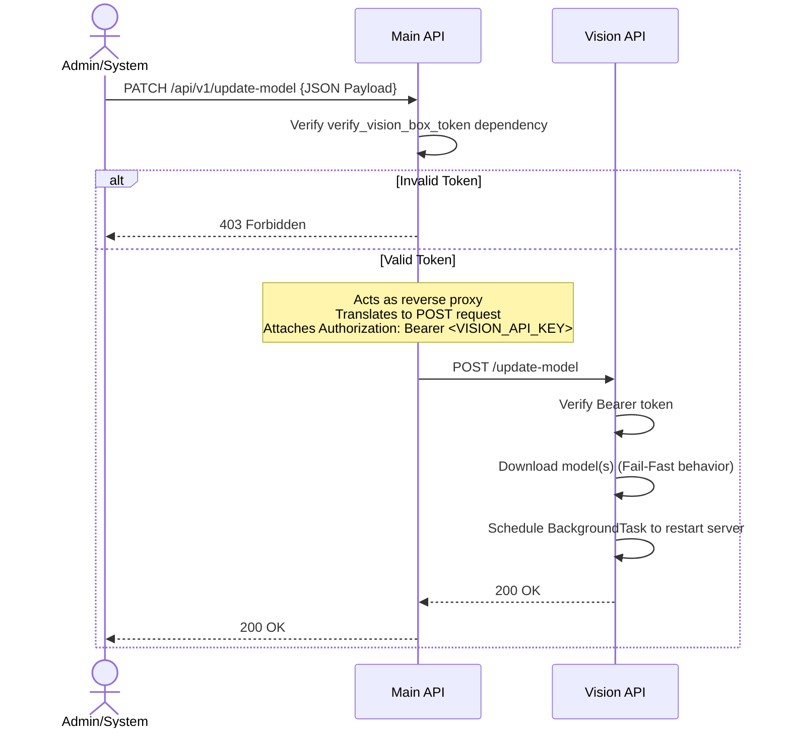

# Vision integration

Standalone microservice for high-fidelity analysis of locker contents.

## Dual-phase analysis

API coordinates parallel requests after a photo upload:

1. **Object detection:** Verifies locker occupancy state (YOLO26 Medium).
2. **Segmentation:** Identifies scratches or cracks (YOLO26 Segmentation).

## Finalization logic

Ensures slow AI calls do not hold database locks:

1. **Inference phase:** Pre-flight read and AI processing (unlocked).
2. **Commit phase:** Acquire fail-fast locks and apply state transitions.

## Model updates

Administrators can trigger atomic updates of the YOLO weights using a reverse-proxied request. The system supports two modes of delivery:

- **Local file upload:** Pushing a `.pt` file from a local machine directly to the Vision service.
- **Remote URL pull:** Instructing the Vision service to download a `.pt` file from a secure HTTPS URL.

### Deployment utility

A Python utility is provided at `backend/api/scripts/deploy_models.py` to manage these updates.

**Usage:**

1. Navigate to the `backend/api` directory.
2. Execute the utility using `uv`, providing either a local path or a URL:

   ```bash
   # Local upload
   uv run python scripts/deploy_models.py --detection ./my-model.pt

   # Remote pull
   uv run python scripts/deploy_models.py --segmentation https://example.com/seg.pt
   ```

- **Authentication:** The utility uses the `VISION_API_KEY` (sent as `X-Device-Token`) to authenticate with the Main API.
- **Internal security:** The Main API uses that same `VISION_API_KEY` (Authorization Bearer) to securely proxy the request to the Vision microservice.- **Automation:** Upon receiving a new `.pt` file, the Vision service automatically clears old OpenVINO exports and restarts to load the new weights.

## Advanced workflow: pre-converted models

For faster deployments, models can be pre-converted to OpenVINO format on a high-performance machine (e.g., with a GPU) and delivered manually to the Vision service.

1. **Export:** On the source machine, run `model.export(format="openvino")`.
2. **Delivery:** Copy the resulting directory (e.g., `best_openvino_model/`) into the Vision Docker's persistent volume (`/app/models/`).
3. **Naming:** The directory must follow the naming convention `<model_name>_openvino_model`. For example, if the target is `detection.pt`, the folder must be `detection_openvino_model`.
4. **Loading:** Upon restart, the service will detect the existing directory and skip the internal conversion process.


