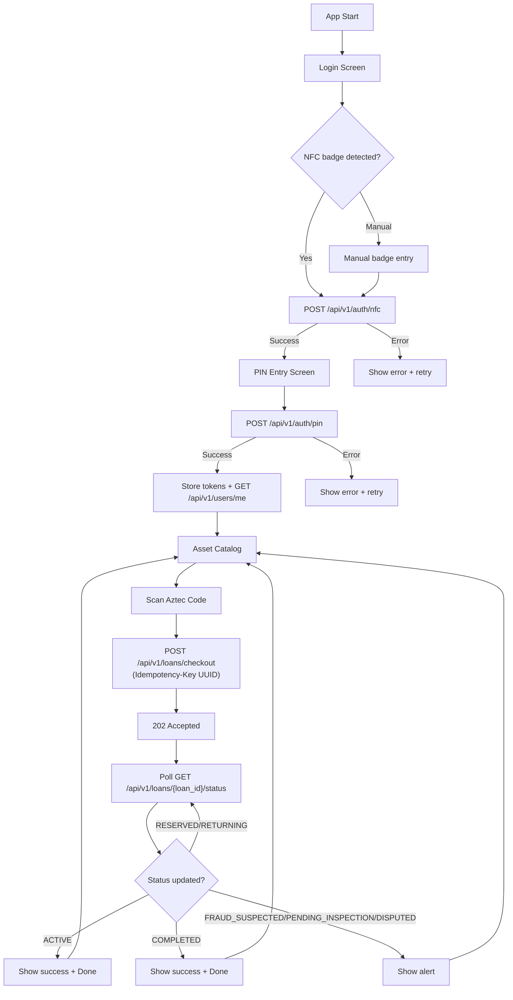

# Mermaid

```mermaid
flowchart TD
    Start[App Start] --> Login[Login Screen]

    Login --> NFC{NFC badge detected?}
    NFC -->|Yes| ValidateNFC["POST /api/v1/auth/nfc"]
    NFC -->|Manual| ManualEntry[Manual badge entry]
    ManualEntry --> ValidateNFC

    ValidateNFC -->|Success| PIN[PIN Entry Screen]
    ValidateNFC -->|Error| NFCError[Show error + retry]

    PIN --> ValidatePIN["POST /api/v1/auth/pin"]
    ValidatePIN -->|Success| AuthSuccess[Store tokens + GET /api/v1/users/me]
    ValidatePIN -->|Error| PinError[Show error + retry]

    AuthSuccess --> Catalog[Asset Catalog]

    %% CHECKOUT FLOW (Aztec scan + REST polling)
    Catalog --> ScanAztec[Scan Aztec Code]
    ScanAztec --> Checkout["POST /api/v1/loans/checkout<br/>(Idempotency-Key UUID)"]
    Checkout --> CheckoutAccepted["202 Accepted"]
    CheckoutAccepted --> PollStatus["Poll GET /api/v1/loans/{loan_id}/status"]

    PollStatus --> StatusUpdate{Status updated?}
    StatusUpdate -->|RESERVED/RETURNING| PollStatus
    StatusUpdate -->|ACTIVE| LendSuccess[Show success + Done]
    StatusUpdate -->|COMPLETED| ReturnSuccess[Show success + Done]
    StatusUpdate -->|FRAUD_SUSPECTED/PENDING_INSPECTION/DISPUTED| TransactionError[Show alert]

    LendSuccess --> Catalog
    ReturnSuccess --> Catalog
    TransactionError --> Catalog

```
