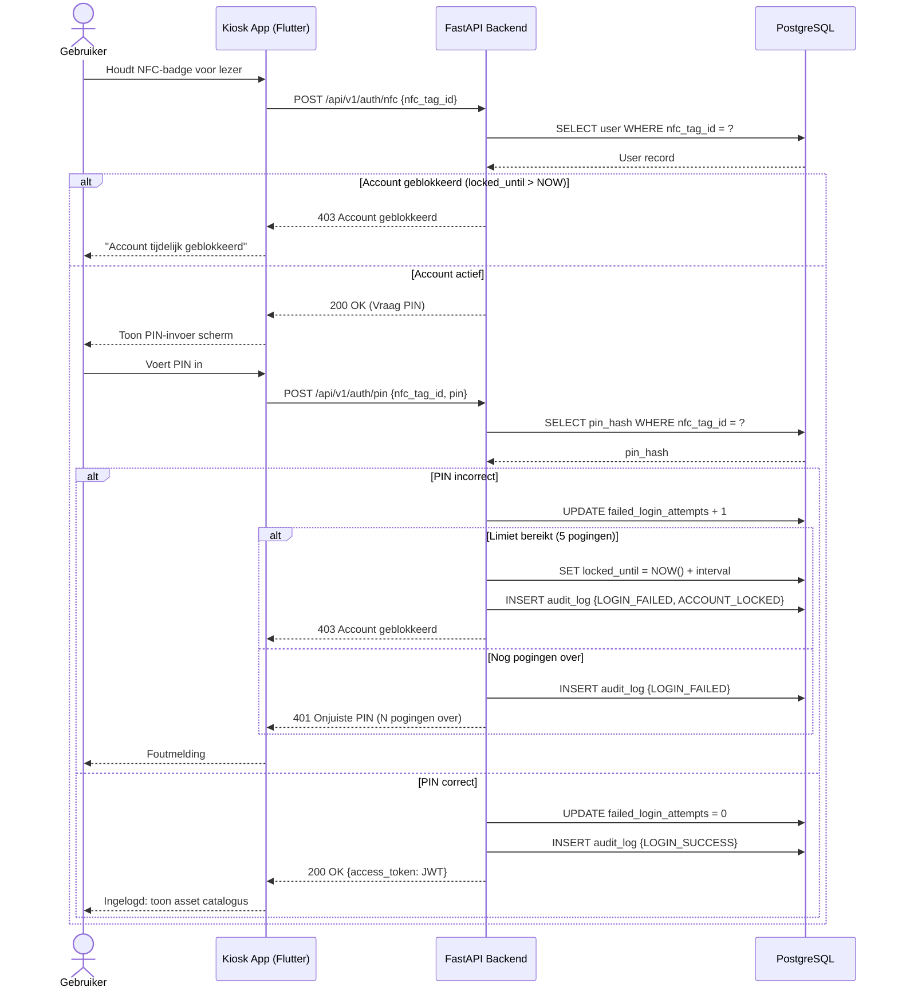
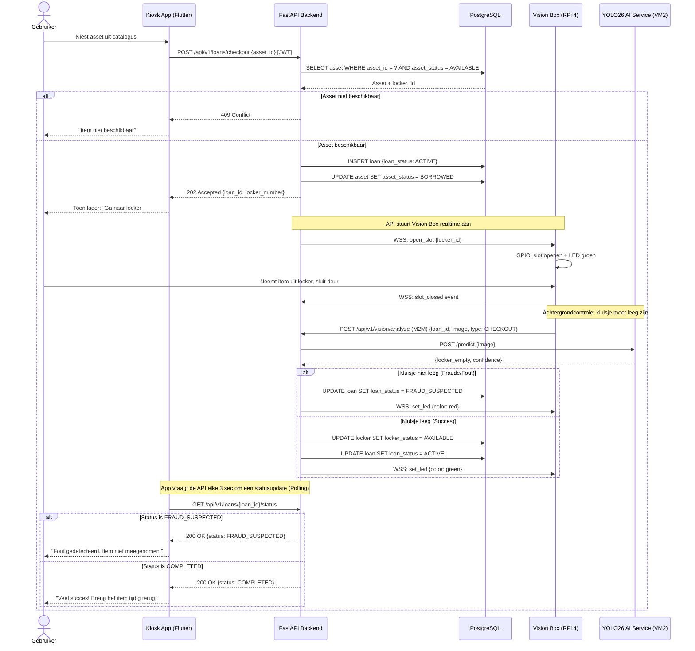
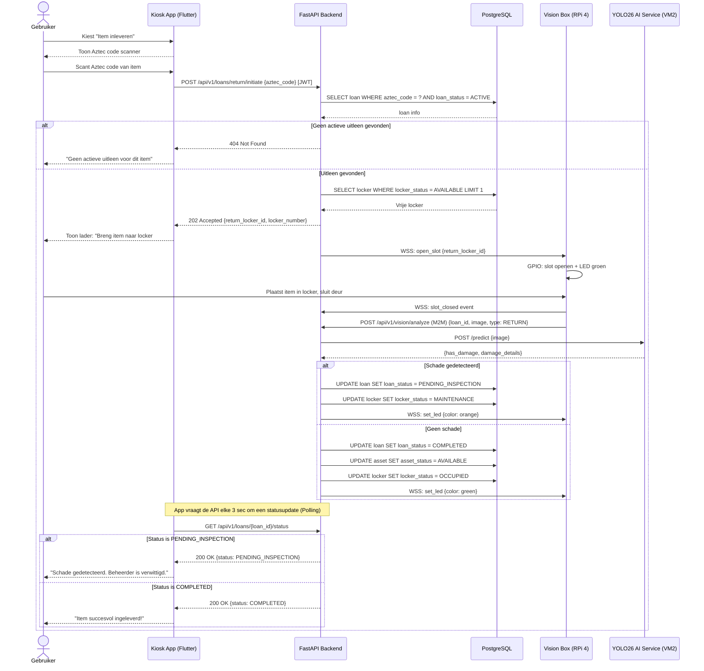
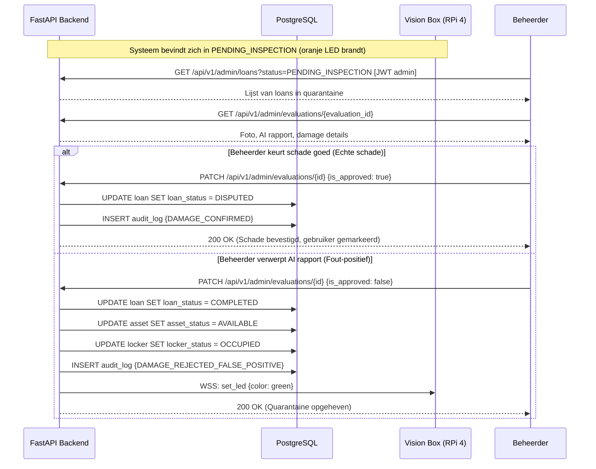

# EasyLend workflows

> Dit document beschrijft de definitieve systeemworkflows via sequence diagrammen.
> Architectuur: De Kiosk App communiceert via REST (met Polling voor asynchrone hardware-acties). De Vision Box luistert naar commando's via WebSockets (WSS).

De vier kernflows zijn:

1. Login
2. Checkout (Uitlenen)
3. Return (Inleveren)
4. Quarantaine (Schade-afhandeling)

---

## 1. Login Flow (NFC + PIN)

De gebruiker scant zijn NFC-badge en voert zijn PIN in om een JWT-token te ontvangen. Ingebouwd anti-brute-force mechanisme blokkeert het account na 5 mislukte pogingen.

---

## 2. Checkout Flow (Item uitlenen)

De app vraagt een lening aan via REST. De API stuurt de Vision Box aan via WSS. De app "pollt" intussen de API om te weten of de hardware- en AI-acties zijn voltooid.

---

## 3. Return Flow (Item inleveren)

De gebruiker scant de Aztec code via de tablet. De API wijst een leeg kluisje toe. Na het sluiten controleert de AI of het item daadwerkelijk in het kluisje ligt en of er schade is.

---

## 4. AI Quarantaine Flow (Schade gedetecteerd)

Wanneer de AI in de Return Flow schade detecteert, moet een menselijke admin dit goedkeuren of verwerpen via het dashboard.

