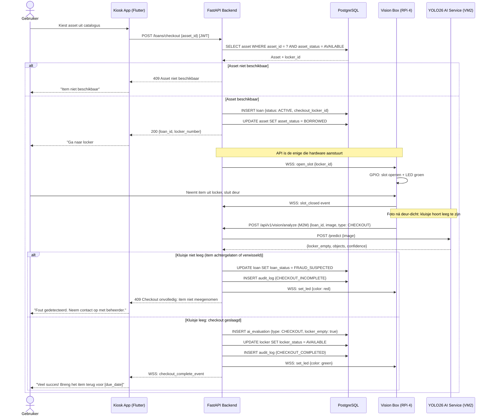
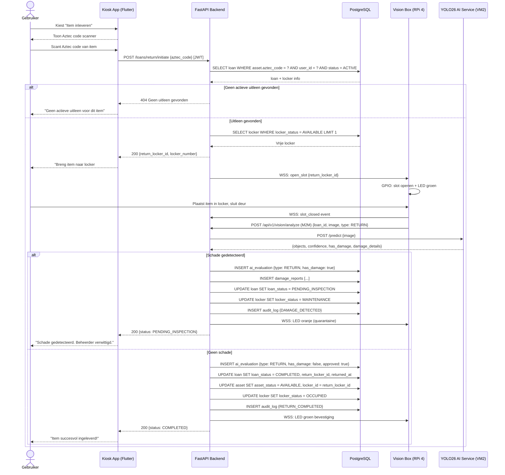
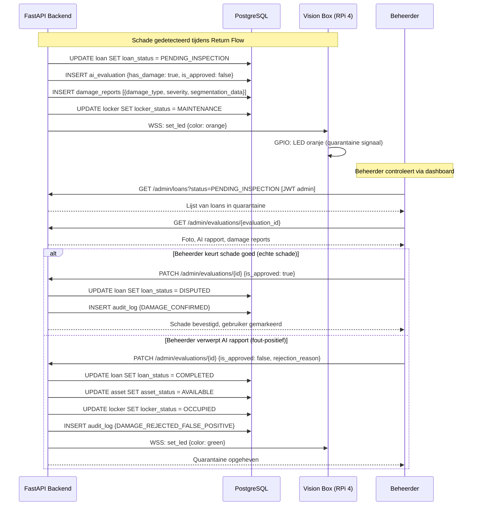

# EasyLend workflows

> Dit document is nog in ontwikkeling en kan nog wijzigen. Momenteel is dit een prototype van de workflow diagrammen.

Dit document beschrijft de voornaamste gebruikers- en systeemworkflows via sequence diagrammen.

De vier kernflows zijn:

1. Login
2. Checkout
3. Return
4. Quarantaine

## 1. Login Flow (NFC + PIN)

De gebruiker scant zijn NFC-badge en voert zijn PIN in om een JWT-token te ontvangen.
Ingebouwd anti-brute-force mechanisme blokkeert het account na meerdere mislukte pogingen.

---

## 2. Checkout Flow (Item uitlenen)

De gebruiker kiest een item in de app. De API valideert de aanvraag en opent **zelf** het slot via de Vision Box: de App heeft nooit directe controle over hardware. Na het sluiten van de deur fotografeert de Vision Box het kluisje om te bevestigen dat het **leeg** is.

---

## 3. Return Flow (Item inleveren)

De gebruiker brengt een item terug. De Vision Box fotografeert voor en na het plaatsen. YOLO26 detecteert eventuele schade.

---

## 4. AI Quarantaine Flow (schade gedetecteerd)

Wanneer YOLO26 schade detecteert bij een inlevering, wordt het kluisje automatisch geblokkeerd en wordt een beheerder verwittigd.

