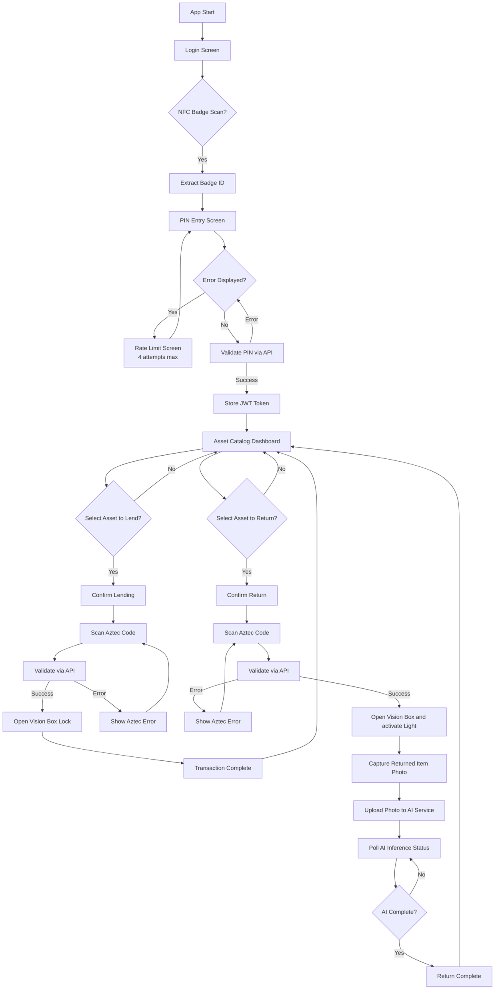

# Mermaid

```mermaid
flowchart
    Start[App Start] --> Login[Login Screen]

    Login --> NFC{NFC Badge Scan?}
    NFC -->|Yes| BadgeID[Extract Badge ID]
    BadgeID --> PIN[PIN Entry Screen]

    PIN --> ShowError{Error Displayed?}
    ShowError -->|Yes| RateLimit[Rate Limit Screen<br/>4 attempts max]
    ShowError -->|No| Validate[Validate PIN via API]

    Validate -->|Success| AuthSuccess[Store JWT Token]
    Validate -->|Error| ShowError

    RateLimit --> PIN

    AuthSuccess --> Dashboard[Asset Catalog Dashboard]

    Dashboard --> SelectAsset{Select Asset to Lend?}
    SelectAsset -->|Yes| ConfirmLend[Confirm Lending]
    SelectAsset -->|No| Dashboard

    ConfirmLend --> ScanAztec[Scan Aztec Code]
    ScanAztec --> ValidateAztec[Validate via API]
    ValidateAztec -->|Success| OpenBox[Open Vision Box Lock]
    ValidateAztec -->|Error| ShowAztecError[Show Aztec Error]
    ShowAztecError --> ScanAztec

    OpenBox --> LendSuccess[Transaction Complete]
    LendSuccess --> Dashboard

    Dashboard --> SelectReturn{Select Asset to Return?}
    SelectReturn -->|Yes| ConfirmReturn[Confirm Return]
    ConfirmReturn --> ScanAztecReturn[Scan Aztec Code]
    ScanAztecReturn --> ValidateAztecReturn[Validate via API]
    ValidateAztecReturn -->|Error| ShowAztecErrorReturn[Show Aztec Error]
    ShowAztecErrorReturn --> ScanAztecReturn

    ValidateAztecReturn -->|Success| ActivateLight[Open Vision Box and activate Light]
    SelectReturn -->|No| Dashboard

    ActivateLight --> CapturePhoto[Capture Returned Item Photo]
    CapturePhoto --> UploadPhoto[Upload Photo to AI Service]

    UploadPhoto --> PollAI[Poll AI Inference Status]
    PollAI --> AIComplete{AI Complete?}
    AIComplete -->|Yes| ReturnSuccess[Return Complete]
    AIComplete -->|No| PollAI

    ReturnSuccess --> Dashboard

```
