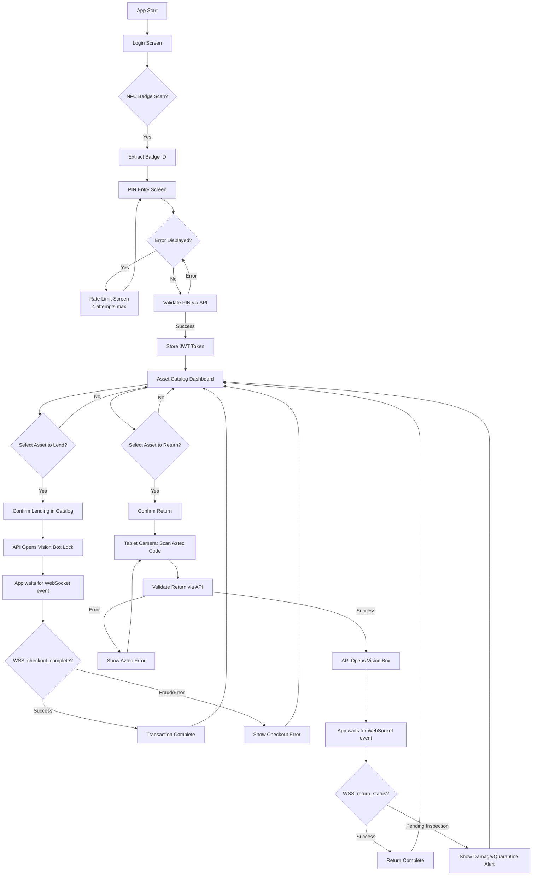

# Mermaid

```mermaid
flowchart TD
    Start[App Start] --> Login[Login Screen]

    Login --> NFC{NFC Badge Scan?}
    NFC -->|Yes| BadgeID[Extract Badge ID]
    BadgeID --> PIN[PIN Entry Screen]

    PIN --> ShowError{Error Displayed?}
    ShowError -->|Yes| RateLimit[Rate Limit Screen<br/>4 attempts max]
    ShowError -->|No| Validate[Validate PIN via API]

    Validate -->|Success| AuthSuccess[Store JWT Token]
    Validate -->|Error| ShowError

    RateLimit --> PIN

    AuthSuccess --> Dashboard[Asset Catalog Dashboard]

    %% CHECKOUT FLOW (Uitlenen)
    Dashboard --> SelectAsset{Select Asset to Lend?}
    SelectAsset -->|Yes| ConfirmLend[Confirm Lending in Catalog]
    SelectAsset -->|No| Dashboard

    ConfirmLend --> APIOpenBox[API Opens Vision Box Lock]
    APIOpenBox --> WaitForWSS[App waits for WebSocket event]
    
    WaitForWSS --> WSSCheckoutEvent{WSS: checkout_complete?}
    WSSCheckoutEvent -->|Success| LendSuccess[Transaction Complete]
    WSSCheckoutEvent -->|Fraud/Error| CheckoutError[Show Checkout Error]
    
    CheckoutError --> Dashboard
    LendSuccess --> Dashboard

    %% RETURN FLOW (Inleveren met Tablet Camera)
    Dashboard --> SelectReturn{Select Asset to Return?}
    SelectReturn -->|Yes| ConfirmReturn[Confirm Return]
    SelectReturn -->|No| Dashboard

    ConfirmReturn --> ScanAztecReturn[Tablet Camera: Scan Aztec Code]
    ScanAztecReturn --> ValidateAztecReturn[Validate Return via API]
    
    ValidateAztecReturn -->|Error| ShowAztecErrorReturn[Show Aztec Error]
    ShowAztecErrorReturn --> ScanAztecReturn

    ValidateAztecReturn -->|Success| ReturnOpenBox[API Opens Vision Box]
    ReturnOpenBox --> WaitReturnWSS[App waits for WebSocket event]

    WaitReturnWSS --> WSSReturnEvent{WSS: return_status?}
    WSSReturnEvent -->|Success| ReturnSuccess[Return Complete]
    WSSReturnEvent -->|Pending Inspection| ReturnQuarantine[Show Damage/Quarantine Alert]

    ReturnQuarantine --> Dashboard
    ReturnSuccess --> Dashboard

```
